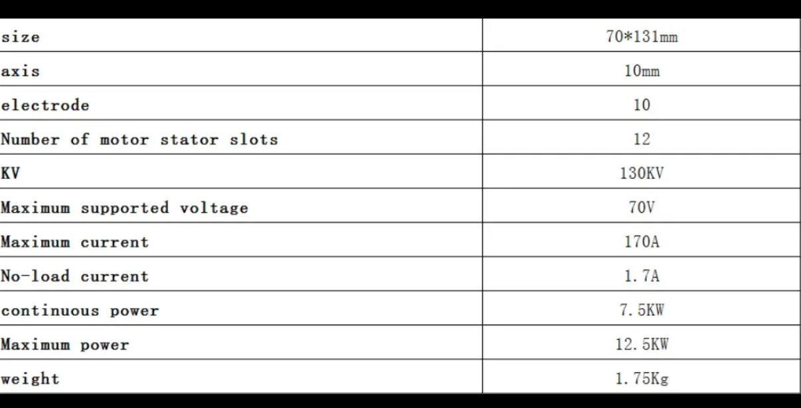

# VESC
An ESC is a device that controls a brushless motor. Brushless motors operate in 3 alternating phases. Simply put, an ESC is able to provide voltages across the 3 wires that create alternating magnetic fields in the motor cauisng it to spin.
[VESC](vesc-project.com) is an advanced, open-source ESC project. Essentially a VESC does the same thing as an ESC but allows for much greater control including configuring power draw, providing specific settings for the motor, monitoring power usage, and more.

## VESC Software
It is important that the VESC has the approiate settings for the motor. You need to set the correct voltage and current limits and other settings for the motor. VESCs can be controlled with the VESC Tool, which you can find [here](https://vesc-project.com/vesc_tool). Because our VESC does not have Bluetooth, you must use it on a computer connected to the USB C on the VESC.

Here are the specs for our ApisQueen motor for reference:

*Note: I believe in the VESC tool there is an autoconfiguration tool that runs test on the motor to detect its properties that worked best.*

*It looks like VESC Tool has undergone some changes so some things might have changed slightly*
